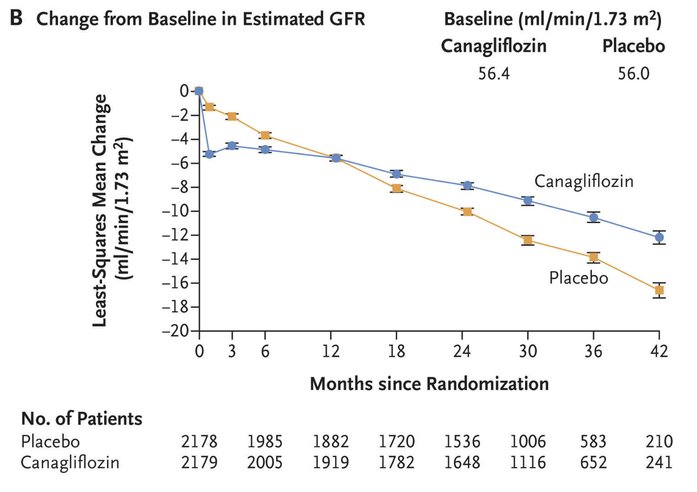

# Modelling eGFR Slope <a href='https://www.georgeinstitute.org'></a>
 
<!-- badges: start -->


<!-- badges: end -->

## Disclaimer

This code is still in development and is therefore subject to major change over the coming weeks.

## Updates

```
19 January 2025

The `compute_slope()` function now supports two new major features:

1. Subgroups: You can compute eGFR slope for any number of subgroups (previously limited to 
   two). To do this, ensure your subgroup variable is coded correctly (see guidance below) 
   and pass it via the `.by` argument.
2. Heterogeneity Testing: The function now calculates a chi-squared statistic and p-value 
   for comparing slopes across subgroups. These results are displayed in the console
   message when you run the function. We plan to refine and expand this feature in the 
   coming months.
```

## Overview

This repository provides a step-by-step guide to standardised modelling of estimated glomerular filtration rate (eGFR) slope in clinical trials, developed by the SGLT2 inhibitor Meta-Analysis Cardio-Renal Trialists Consortium (SMART-C). An accompanying reproducible example (reprex) using synthetically-generated data is also provided in the [`code`](https://github.com/ra-fletcher/smartc_egfr_slope/tree/main/code) folder.

A quick note about the reprex: its primary goal is to demonstrate how to structure the data, specify the model, and extract results for acute, chronic, and total eGFR slopes. We generated the synthetic data using the [`simstudy`](https://kgoldfeld.github.io/simstudy/) R package, ensuring they share the same marginal distributions as the CREDENCE trial. Precisely emulating every variable relationship within longitudinal data is complex, so the model outputs here won’t perfectly match real clinical trial results. The main focus is to illustrate the underlying methodology.

For further details on the statistical methods behind modelling of eGFR slope, please see the original publication here: [Vonesh et al., 2019](https://onlinelibrary.wiley.com/doi/10.1002/sim.8282).

## Dependencies

To get this code to work, please install all dependencies. To install these dependencies (if you haven't already), run the following script:

``` r
libs <- c("glue", "lme4", "multcomp", "simstudy", "tidyverse")

install.packages(setdiff("tidyverse", rownames(installed.packages())))
```

If you have any issues, check your package versions. The following package versions were used for the generation of this code:

``` r
dplyr    - v1.1.4
glue     - v1.7.0
lme4     - v1.1-35.3
multcomp - v1.4-26
readr    - v2.1.5
simstudy - v0.8.1
stringr  - v1.5.1
tibble   - v3.2.1
tidyr    - v1.3.1
```

## Folder structure

Below is an overview of the folders in this repository that are actively synchronised with GitHub.

### code

`code` contains the reprex code: `modelling_egfr_slope_reprex.R` - this reprex will show you how to calculate eGFR slope for the trial overall (active, control, and comparison) and for two groups in a binary subgroup variable (in this example, baseline use of glucagon-like peptide-1 receptor agonist (GLP-1RA) yes/no).

### data

`data` contains synthetic baseline `synthetic_trial_baseline.csv` and follow-up `synthetic_trial_follow_up_egfr.csv` data used in the reprex.

### figs

`figs` contains the logo for the SGLT2 inhibitor Meta-Analysis Cardio-Renal Trialists Consortium (SMART-C) and the CREDENCE eGFR figure used for this README.

### src

`src` contains any files that are called via `source()` in the scripts in `code`. In this instance, the functions used to generate the synthetic data and to extract results from the mixed model.

## Guide

The aim of this repository is to provide a systematic guide to modelling eGFR slope using R. This guide, enclosed within the repository `README`, will provide a visual guide to:

1. Setting-up the data into the required format
2. Specifying the model
3. Extracting the relevant model results (including acute slope, chronic slope, and total slope)

This guide will demonstrate how to model eGFR slope for the total trial population. If you'd like to know how to apply this code in subgroups, please see the reprex in the [`code`](https://github.com/ra-fletcher/smartc_egfr_slope/tree/main/code) folder.

### Data

The simulated data is for a hypothetical trial of 5000 participants randomised 1:1 to either an SGLT2 inhibitor or placebo (2500 per arm).

Since your trial data will likely be standardised to the [Analysis Data Model (ADaM)](https://www.cdisc.org/standards/foundational/adam), the simulated data has been set-up to imitate a truncated version of the "subject-level analysis dataset" `ADSL`, here termed `baseline` or `bl` and repeat eGFR measurements from the "laboratory - within 2 days of the last meds" dataset `ADLBM`, here termed `follow-up` or `fu`. If you'd like to know what each of the columns in the datasets are, please see the [`README`](https://github.com/ra-fletcher/smartc_egfr_slope/tree/main/data) for the data folder of this repository.

Here is a visual snapshot of the baseline data:

``` r
# Source function to generate synthetic data
source(glue::glue("{path}/src/generate_synthetic_data.R"))

# Generate synthetic baseline data (derived from ADSL)
bl <- generate_synthetic_data(.table = "baseline")

# Print baseline data
print(bl, n = 10)
#> # A tibble: 5,000 × 8
#>    usubjid trt01pn randfl ittfl trtfl blgfr blglp1 strata                                
#>    <chr>     <int> <chr>  <chr> <chr> <int> <chr>  <chr>                                 
#>  1 id0001        0 Y      Y     Y        54 N      Screening eGFR 45 to <60 mL/min/1.73m2
#>  2 id0002        1 Y      Y     Y        27 N      Screening eGFR 45 to <60 mL/min/1.73m2
#>  3 id0003        1 Y      Y     Y        50 N      Screening eGFR 45 to <60 mL/min/1.73m2
#>  4 id0004        0 Y      Y     Y        47 N      Screening eGFR 45 to <60 mL/min/1.73m2
#>  5 id0005        0 Y      Y     Y        75 N      Screening eGFR 60 to <90 mL/min/1.73m2
#>  6 id0006        0 Y      Y     Y        30 N      Screening eGFR 30 to <45 mL/min/1.73m2
#>  7 id0007        0 Y      Y     Y        56 N      Screening eGFR 45 to <60 mL/min/1.73m2
#>  8 id0008        1 Y      Y     Y        59 N      Screening eGFR 60 to <90 mL/min/1.73m2
#>  9 id0009        1 Y      Y     Y        65 N      Screening eGFR 60 to <90 mL/min/1.73m2
#> 10 id0010        1 Y      Y     Y        70 N      Screening eGFR 60 to <90 mL/min/1.73m2
#> # … with 4,990 more rows
#> # ℹ Use `print(n = ...)` to see more rows
```

Here is a visual snapshot of the follow-up data:

``` r
# Generate synthetic follow-up data (derived from ADLBM)
fu <- generate_synthetic_data(.table = "follow-up")

# Print follow-up data
print(fu, n = 10)
#> # A tibble: 41,800 × 12
#>    usubjid randfl ittfl trtfl anl01fl  aval  base paramcd  param                                                  ady avisitn avisit  
#>    <chr>   <chr>  <chr> <chr> <chr>   <dbl> <int> <chr>    <chr>                                                <dbl>   <dbl> <chr>   
#>  1 id0001  Y      Y     Y     Y          54    54 GFRBSCRT GFR from Creatinine Adjusted for BSA (mL/min/1.73m2)     1       0 BASELINE
#>  2 id0001  Y      Y     Y     Y          51    54 GFRBSCRT GFR from Creatinine Adjusted for BSA (mL/min/1.73m2)    22       3 WEEK 3  
#>  3 id0001  Y      Y     Y     Y          61    54 GFRBSCRT GFR from Creatinine Adjusted for BSA (mL/min/1.73m2)    91      13 WEEK 13 
#>  4 id0001  Y      Y     Y     Y          63    54 GFRBSCRT GFR from Creatinine Adjusted for BSA (mL/min/1.73m2)   183      26 WEEK 26 
#>  5 id0001  Y      Y     Y     Y          53    54 GFRBSCRT GFR from Creatinine Adjusted for BSA (mL/min/1.73m2)   362      52 WEEK 52 
#>  6 id0001  Y      Y     Y     Y          47    54 GFRBSCRT GFR from Creatinine Adjusted for BSA (mL/min/1.73m2)   544      78 WEEK 78 
#>  7 id0001  Y      Y     Y     Y          37    54 GFRBSCRT GFR from Creatinine Adjusted for BSA (mL/min/1.73m2)   726     104 WEEK 104
#>  8 id0001  Y      Y     Y     Y          58    54 GFRBSCRT GFR from Creatinine Adjusted for BSA (mL/min/1.73m2)   911     130 WEEK 130
#>  9 id0001  Y      Y     Y     Y          59    54 GFRBSCRT GFR from Creatinine Adjusted for BSA (mL/min/1.73m2)  1092     156 WEEK 156
#> 10 id0002  Y      Y     Y     Y          27    27 GFRBSCRT GFR from Creatinine Adjusted for BSA (mL/min/1.73m2)     1       0 BASELINE
#> # … with 41,790 more rows
#> # ℹ Use `print(n = ...)` to see more rows
```

The first objective is to define the time point at which to place the knot in the spline fitted to the model. The reason for doing this is because of the acute drop in eGFR that is observed on initiation of an SGLT2 inhibitor. This should correspond to the first follow-up visit in your trial. For instance, in the DAPA-CKD trial ([Heerspink et al., 2020](https://www.nejm.org/doi/full/10.1056/NEJMoa2024816)), this is at 2 weeks (~14 days) post-randomisation, and in the CREDENCE trial ([Perkovic et al., 2019](https://www.nejm.org/doi/full/10.1056/nejmoa1811744)), this is at 3 weeks (~21 days) (see figure below).

<p align="center">
    
    <em style="color: green"> The change from the screening level in the estimated GFR in the on-treatment population (Perkovic et al., 2019). </em>
</p>

``` r
# Set knot point for spline. This is 3 weeks/21 days in the CREDENCE trial
k <- 21
```

Next, the data need to be formatted correctly. You will need to specify in the "on-treatment" population in both datasets, and filter for the analysis values in the follow-up eGFR data. This is what was done in the SGLT2 inhibitor trials but you may not need to do the same in your study. You'll also notice that the code generates a "spline term" column. This needs to be set at `0` for times before the knot, and at `time - k / 365.25` for all times after the knot.

The data object `gfr_c` is how you want the data to appear before you commence modelling.

``` r
# Treatment arms (filtering for on-treatment individuals only)
arm <- bl |> 
  dplyr::filter(trtfl == "Y") |> 
  dplyr::select(usubjid, trt01pn, blglp1, strata) |> 
  dplyr::mutate(blglp1 = dplyr::if_else(blglp1 == "Y", 1, 0))

# Repeat eGFR (filtering for on-treatment values and those flagged for analysis)
gfr <- fu |> 
  dplyr::filter(dplyr::if_all(c(trtfl, anl01fl), \(x) x == "Y")) |> 
  dplyr::distinct(usubjid, aval, ady, base, avisitn)

# Join
gfr_c <- arm |> 
  dplyr::left_join(gfr, by = dplyr::join_by(usubjid), multiple = "all") |> 
  dplyr::mutate(
    # Convert days from baseline to years
    time = ady / 365.25,
    # Generate spline term
    spline = dplyr::if_else(time >= k / 365.25, time - k / 365.25, 0)
  )
  
# Print combined data
print(gfr_c, n = 10)
#> # A tibble: 40,957 × 10
#>    usubjid trt01pn blglp1 strata                                  aval   ady  base avisitn    time  spline
#>    <chr>     <int>  <dbl> <chr>                                  <dbl> <dbl> <int>   <dbl>   <dbl>   <dbl>
#>  1 id0001        0      0 Screening eGFR 45 to <60 mL/min/1.73m2    54     1    54       0 0.00274 0      
#>  2 id0001        0      0 Screening eGFR 45 to <60 mL/min/1.73m2    51    22    54       3 0.0602  0.00274
#>  3 id0001        0      0 Screening eGFR 45 to <60 mL/min/1.73m2    61    91    54      13 0.249   0.192  
#>  4 id0001        0      0 Screening eGFR 45 to <60 mL/min/1.73m2    63   183    54      26 0.501   0.444  
#>  5 id0001        0      0 Screening eGFR 45 to <60 mL/min/1.73m2    53   362    54      52 0.991   0.934  
#>  6 id0001        0      0 Screening eGFR 45 to <60 mL/min/1.73m2    47   544    54      78 1.49    1.43   
#>  7 id0001        0      0 Screening eGFR 45 to <60 mL/min/1.73m2    37   726    54     104 1.99    1.93   
#>  8 id0001        0      0 Screening eGFR 45 to <60 mL/min/1.73m2    58   911    54     130 2.49    2.44   
#>  9 id0001        0      0 Screening eGFR 45 to <60 mL/min/1.73m2    59  1092    54     156 2.99    2.93   
#> 10 id0002        1      0 Screening eGFR 45 to <60 mL/min/1.73m2    27     1    27       0 0.00274 0      
#> # … with 40,947 more rows
#> # ℹ Use `print(n = ...)` to see more rows
```

Here is what each of the columns correspond to:

| Variable  | Type      | Description                                                                   |
| --------- | ----------| ----------------------------------------------------------------------------- |
| `usubjid` | Character | Unique subject identifier                                                     |
| `trt01pn` | Integer   | Numeric indicator for treatment assignment; `0` == "Placebo", `1` == "SGLT2i" |
| `blglp1`  | Double    | Numeric indicator for baseline GLP1-RA use; `0` == "No", `1` == "Yes"         |
| `strata`  | Character | Study strata (not required)                                                   |
| `aval`    | Double    | Estimated glomerular filtration rate (eGFR) value at study visit              |
| `ady`     | Double    | Days from baseline                                                            |
| `base`    | Integer   | Baseline eGFR value                                                           |
| `avisitn` | Double    | Study visit (weeks from baseline; numeric)                                    |
| `time`    | Double    | Years from baseline (`ady` / 365.25)                                          |
| `spline`  | Double    | Spline term                                                                   |

### Model

The model used to calculate eGFR slope is a mixed effects model with an unstructured residual variance-covariance matrix. Typically we would adjust for the stratification term in the trial (categories of screening eGFR in the CREDENCE trial or diabetes status/UACR categories in DAPA-CKD trial), but whether you choose to do this in your study will depend on your data and analysis plan. The function required to run the model is `lme4::lmer()`, and the unstructured residual variance-covariance matrix is specified with `(time | usubjid)`. Adding `-1` ensures that no intercept is fitted.

``` r
# Fit mixed effects model with unstructured residual variance-covariance matrix
fit <- lme4::lmer(
  aval ~ base + strata + time * trt01pn + spline * trt01pn - 1 + (time | usubjid), 
  data = gfr_c
)
```

### Extracting Results

Once you have fit your model, you then need to use linear combinations to calculate each desired result. We have written a simple function `compute_slope()` which at its core is a wrapper for `multcomp::glht()` but provides output as a `tibble` for easier manipulation and export. All you need to do is to provide the names of key variables in your model and whether you'd like to compute acute, chronic, total, or all slope types. Below is an example of computing all slope types. The function will print the coefficients that are indexed for each calculation, as well as the contrast vector that is being used compute the slope estimate.

``` r
# Define proportion of total slope accounted-for by chronic slope (1095.75 is
# the equivalent of 3 years in days, so we if we subtract the number of days in 
# the acute slope, approximately 21 days or 3 weeks, we get this proportion 
prop <- (1095.75 - 21) / 1095.75

# eGFR slope for the whole cohort
all <- compute_slope(
  .model_obj = fit, .time_var = "time", .intervention_var = "trt01pn", .spline_var = "spline", 
  .prop = prop, .output = "all"
)
#> Slopes computed: Total
#> Output collated in dataframe extension of type `tibble`.
#> --------------------------------------------------------
#> Acute slope
#> Control
#> Linear combination: `time`
#> Contrast vector: c(0, 0, 0, 0, 1, 0, 0, 0, 0)
#> Active
#> Linear combination: `time` + `time:trt01pn`
#> Contrast vector: c(0, 0, 0, 0, 1, 0, 0, 1, 0)
#> Active - Control
#> Linear combination: `time:trt01pn`
#> Contrast vector: c(0, 0, 0, 0, 0, 0, 0, 1, 0)

# Print results
print(all)
#> # A tibble: 9 × 9
#>   slope   group            estimate     lci     uci result                        se t_value p_value
#>   <chr>   <chr>               <dbl>   <dbl>   <dbl> <chr>                      <dbl>   <dbl>   <dbl>
#> 1 Acute   Control           -50.5   -57.9   -43.2   -50.55 (-57.88 to -43.21) 3.74    -13.5   0     
#> 2 Acute   Active            -66.0   -73.3   -58.6   -65.95 (-73.29 to -58.62) 3.74    -17.6   0     
#> 3 Acute   Active - Control  -15.4   -25.8    -5.03  -15.41 (-25.78 to -5.03)  5.29     -2.91  0.0036
#> 4 Chronic Control            -2.46   -2.60   -2.32  -2.46 (-2.60 to -2.32)    0.0714  -34.4   0     
#> 5 Chronic Active             -1.54   -1.68   -1.40  -1.54 (-1.68 to -1.40)    0.0711  -21.6   0     
#> 6 Chronic Active - Control    0.922   0.724   1.12  0.92 (0.72 to 1.12)       0.101     9.15  0     
#> 7 Total   Control            -3.38   -3.54   -3.23  -3.38 (-3.54 to -3.23)    0.0794  -42.6   0     
#> 8 Total   Active             -2.77   -2.93   -2.62  -2.77 (-2.93 to -2.62)    0.0792  -35.0   0     
#> 9 Total   Active - Control    0.608   0.389   0.828 0.61 (0.39 to 0.83)       0.112     5.42  0      
```

The results above are implausible because of the inaccurate nature of the synthetic data, so do not expect your results to look the same. If you would like to know how to run the same analysis for subgroups, an appropriate model object and a `.by` argument can be specified:

``` r
# Recode baseline GLP-1RA use as factor and set `blglp1` == "Yes" as reference
gfr_c <- gfr_c  |> 
  mutate(blglp1 = factor(blglp1, levels = c(1, 0), labels = c("Yes", "No")))

# Fit mixed effects model with unstructured residual variance-covariance matrix
# this time with adjustment and interactions with `blglp1`
fit_subgrp <- lme4::lmer(
  aval ~ base + time * trt01pn + spline * trt01pn + time * blglp1 +
  spline * blglp1 + trt01pn * blglp1 + time * trt01pn * blglp1 + 
  spline * trt01pn * blglp1 - 1 + (time | usubjid), 
  data = gfr_c
)

# By GLP1 use (acute only)
sg <- compute_slope(
  .model_obj = fit_subgrp, .time_var = "time", .intervention_var = "trt01pn", 
  .spline_var = "spline", .prop = prop, .by = "blglp1", .output = "acute"
)
#> Slopes computed: Acute
#> Output collated in dataframe extension of type `tibble`.
#> --------------------------------------------------------
#> Acute slope
#> Control, blglp1 = Yes
#> Linear combination: `time`
#> Contrast vector: c(0, 1, 0, 0, 0, 0, 0, 0, 0, 0, 0, 0, 0)
#> Active, blglp1 = Yes
#> Linear combination: `time` + `time:trt01pn`
#> Contrast vector: c(0, 1, 0, 0, 0, 0, 1, 0, 0, 0, 0, 0, 0)
#> Active - Control, blglp1 = Yes
#> Linear combination: `time:trt01pn`
#> Contrast vector: c(0, 0, 0, 0, 0, 0, 1, 0, 0, 0, 0, 0, 0)
#> Control, blglp1 = No
#> Linear combination: `time` + `time:blglp1No`
#> Contrast vector: c(0, 1, 0, 0, 0, 0, 0, 0, 1, 0, 0, 0, 0)
#> Active, blglp1 = No
#> Linear combination: `time` + `time:blglp1No` + `trt01pn:blglp1No` + `time:trt01pn:blglp1No`
#> Contrast vector: c(0, 1, 0, 0, 0, 0, 0, 0, 1, 0, 1, 1, 0)
#> Active - Control, blglp1 = No
#> Linear combination: `time:trt01pn` + `time:trt01pn:blglp1No`
#> Contrast vector: c(0, 0, 0, 0, 0, 0, 1, 0, 0, 0, 0, 1, 0)

# Print results
print(sg)
#> # A tibble: 6 × 11
#>   slope group            subgroup subgroup_cat estimate    lci    uci result                        se t_value p_value
#>   <chr> <chr>            <chr>    <chr>           <dbl>  <dbl>  <dbl> <chr>                      <dbl>   <dbl>   <dbl>
#> 1 Acute Control          blglp1   Yes             -47.4  -86.1  -8.69 -47.41 (-86.12 to -8.69)   19.8   -2.40   0.0164
#> 2 Acute Active           blglp1   Yes             -28.2  -62.9   6.56 -28.19 (-62.94 to 6.56)    17.7   -1.59   0.112 
#> 3 Acute Active - Control blglp1   Yes              19.2  -32.8  71.2  19.22 (-32.80 to 71.24)    26.5    0.724  0.469 
#> 4 Acute Control          blglp1   No              -50.7  -58.1 -43.2  -50.66 (-58.14 to -43.19)   3.81 -13.3    0     
#> 5 Acute Active           blglp1   No              -85.0 -135.  -34.7  -85.03 (-135.35 to -34.71) 25.7   -3.31   0.0009
#> 6 Acute Active - Control blglp1   No              -17.1  -27.6  -6.47 -17.06 (-27.65 to -6.47)    5.40  -3.16   0.0016
```

## Other types of model

``` r

# test <- nlme::lme(
#   aval ~ base + strata + gfr_grp + trt01pn + time + spline + time*trt01pn +
#   spline*trt01pn + time*gfr_grp + spline*gfr_grp + trt01pn*gfr_grp +
#   time*trt01pn*gfr_grp + spline*trt01pn*gfr_grp + -1, # Model
#   random = list(usubjid = pdSymm(form= ~ 1 + time)), # Unstructured covariance matrix
#   na.action=na.omit, data = gfr_c, method  = "REML",
#   control = lmeControl(maxIter = 1e8, msMaxIter = 1e8, opt = "optim", optimMethod = "CG")
# )

```


## Repository Authors

**Robert Fletcher, MSc (Oxon)** - [rfletcher@georgeinstitute.org.au](mailto:rfletcher@georgeinstitute.org.au?subject=Inquiry) | The George Institute for Global Health, Sydney, Australia | British Heart Foundation Cardiovascular Epidemiology Unit, Department of Public Health and Primary Care, University of Cambridge, Cambridge UK

**Niels Jongs, PhD** - [n.jongs@umcg.nl](mailto:n.jongs@umcg.nl?subject=Inquiry) | University Medical Center Groningen, Groningen, Netherlands
